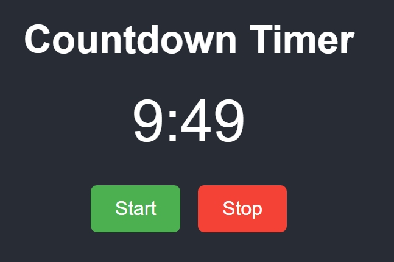

# Countdown Timer App

A simple countdown timer built using HTML, CSS, and JavaScript.

## Description

This project is a basic countdown timer that counts down from a specified time. You can start the timer, and it will count down every second. The timer can be stopped at any moment using the stop button.

## Features

- **Start Timer**: Begin the countdown.
- **Stop Timer**: Halt the countdown at any time.
- **Responsive Design**: Adapts to various screen sizes.

## Screenshot

