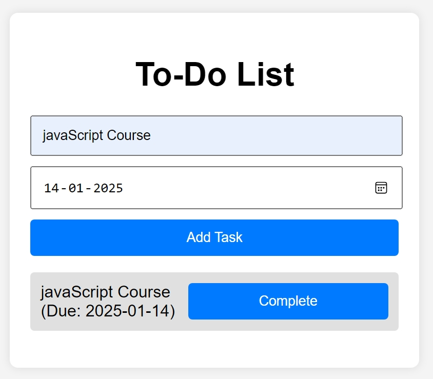
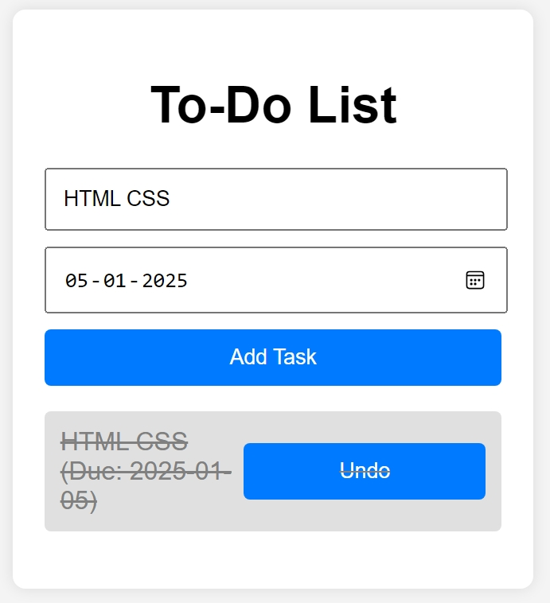

# Enhanced To-Do List App

## Overview

This project is a simple and intuitive To-Do List App built using HTML, CSS, and JavaScript. The app allows users to add tasks with a title and due date, mark tasks as completed, and dynamically update the task list.

## Features

- Add new tasks with a title and due date.
- Display tasks in a list format.
- Mark tasks as completed or undo completion.
- Tasks are stored as objects with properties like `title`, `completed`, and `dueDate`.
- Iterate through tasks using JavaScript `for...in` loop.

## Screenshot

## Technologies Used

- HTML
- CSS
- JavaScript
