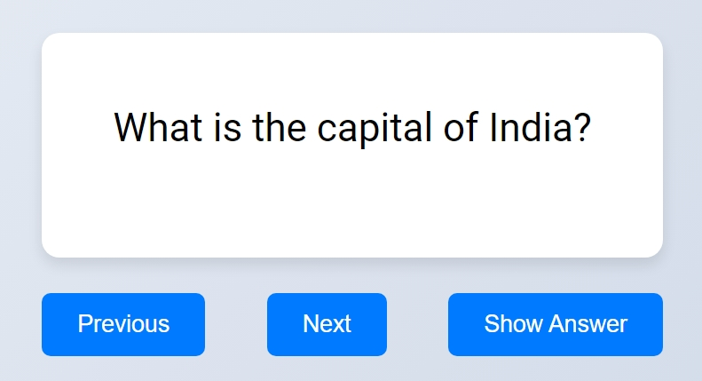

# Flashcard App

## Description

A fun and interactive Flashcard App that helps users test their knowledge by navigating through flashcards with questions and answers. Users can click through the cards and reveal the answers.

## Usage

1. Open index.html in your browser.
2. Use the "Previous", "Next", and "Show Answer" buttons to navigate through the flashcards and reveal answers.

## Features

1. A list of features and functionalities included in your project.
2. Navigate through flashcards with "Previous" and "Next" buttons.
3. Reveal answers with the "Show Answer" button.
