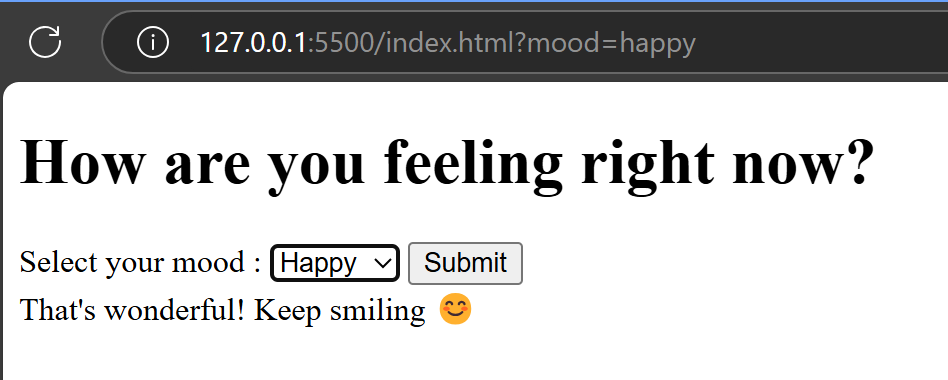

# Interactive Mood Tracker

## Description

An interactive web application that allows users to log their mood for the day. Based on the user's mood selection, the app displays different messages to provide a personalized and engaging experience.

## Installation

Instructions on how to install and set up your project.

# Clone this repository
git clone https://github.com/your-username/interactive-mood-tracker.git

# Go into the repository
cd interactive-mood-tracker

# Install dependencies
npm install

# Features
1. A list of features and functionalities included in your project.
2. Allows users to log their daily mood
3. Displays personalized messages based on the user's mood
