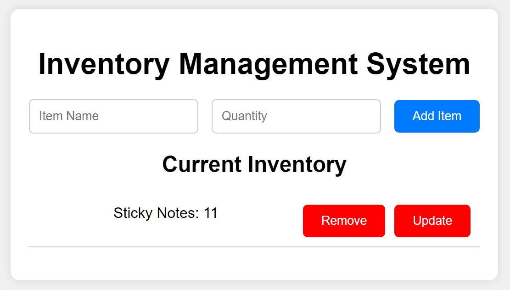

# Inventory Management System

## Description

A simple and interactive Inventory Management System that allows users to add, remove, and update the quantity of items. This project helps in managing inventory efficiently by storing items in an array of objects.

## Usage

1. Open index.html in your browser.
2. Use the input fields to add items with their quantities.
3. Use the buttons next to each item to update or remove them.

## Features

1. A list of features and functionalities included in your project.
2. Add new items to the inventory with name and quantity.
3. Remove items from the inventory.
4. Update the quantity of existing items.
