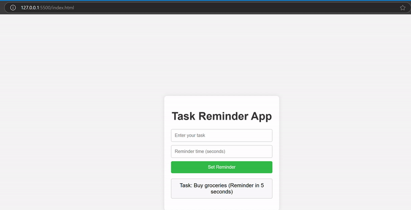

# Task Reminder App

## Overview
The **Task Reminder App** is a simple web application that allows users to set reminders for tasks. Users can input a task and a reminder time, and the app will alert the user when the reminder time is reached. The app demonstrates the use of closures and the `this` keyword in JavaScript to manage timers and event handlers.

## Screenshot

## Features
- Set reminders for tasks with a specified time.
- Display a list of tasks with their reminder times.
- Remove tasks manually before the reminder time.
- Utilize closures to manage timers for each reminder.

## Technologies Used
- HTML
- CSS
- JavaScript
 
## Usage
1. Enter a task in the input field.
2. Enter the reminder time in seconds.
3. Click the "Set Reminder" button to add the task.
4. The task will appear in the list with the reminder time.
5. After the specified time, an alert will remind you of the task, and the task will be removed from the list.
6. Click on a task in the list to remove it manually before the reminder time.
