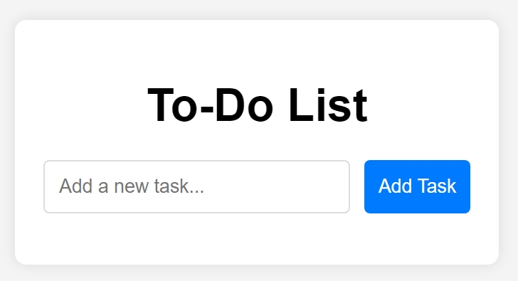

# To-Do List

A simple and intuitive To-Do List application built with HTML, CSS, and JavaScript. This application allows users to add, delete, and mark tasks as completed.

## Features

- Add new tasks
- Delete tasks
- Mark tasks as completed
- Simple and user-friendly interface

## How to Use

1. **Add a Task**:
   - Type a task into the input field.
   - Click the "Add Task" button to add the task to the list.
2. **Delete a Task**:
   - Click the "Delete" button next to a task to remove it from the list.
3. **Mark a Task as Completed**:
   - Click on a task to toggle its completion status. Completed tasks will be marked with a line-through.

## Project Structure

- **index.html**: The main HTML file containing the structure of the application.
- **style.css**: The CSS file for styling the application.
- **script.js**: The JavaScript file for the application logic.
